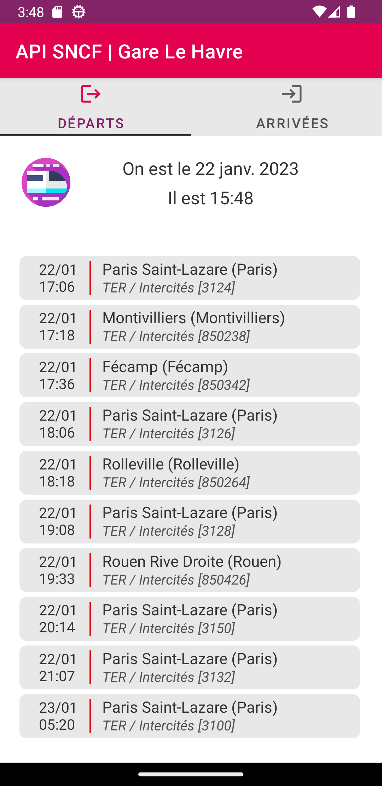
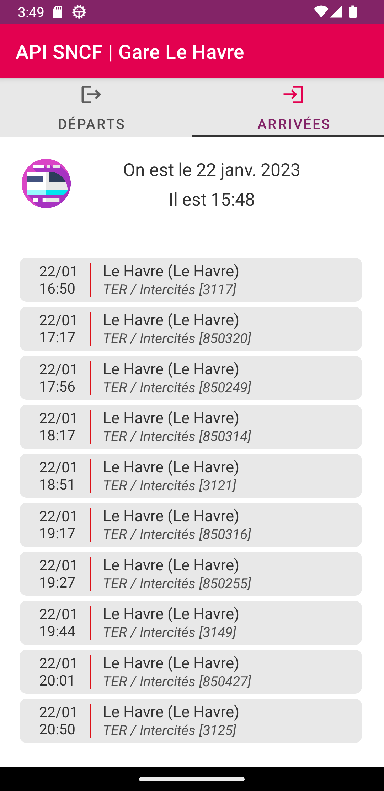

    <h1 align="center">SNCF API Project - Android</h1>
    <h4 align="center">Retrieval of real-time train information</h4>

    
    
    

<table>
    <thead>
        <tr>
            <th width="150px">Year</th>
            <th width="150px">Course</th>
            <th width="300px">Subject</th>
            <th width="300px">Project</th>
            <th width="350px">Collaborators</th>
        </tr>
    </thead>
    <tbody>
        <tr>
        <td align="center">2022-2023</td>
        <td align="center">M2 IWOCS</td>
        <td align="center">Android Programming</td>
        <td align="center">API SNCF</td>
        <td align="center">Léa Gallier & <a href="https://github.com/lrxk">Kévin Leroux</a></td>
        </tr>
    </tbody>
</table>

## About

The objective of this project is to develop an Android application under **Java** (or Kotlin but we have chosen Java) allowing to know the departure and arrival times of trains at Le Havre station using the **API** in real time from **SNCF**.

Our application will be structured as follows: we will have two tabs, a tab for departures and a tab for arrivals. On each tab we will only display the next *10* trains according to the **today's date** and **the current time**. Finally, for each train, the date and time will of course be displayed, but also its **destination** (for example Paris for departures and of course Le Havre for arrival trains), the **type** of train (TER, RER, ...) and its **number**.

On each tab, we will also have the current date and time displayed to allow the user to be sure to choose the right train.

## Result

The application interface is in French

N.B. : app logo source : <a href="https://www.flaticon.com/fr/icones-gratuites/train-a-grande-vitesse" title="Icon | High-speed train">High speed train icons created by graphic designer Freepik - Flaticon</a>
